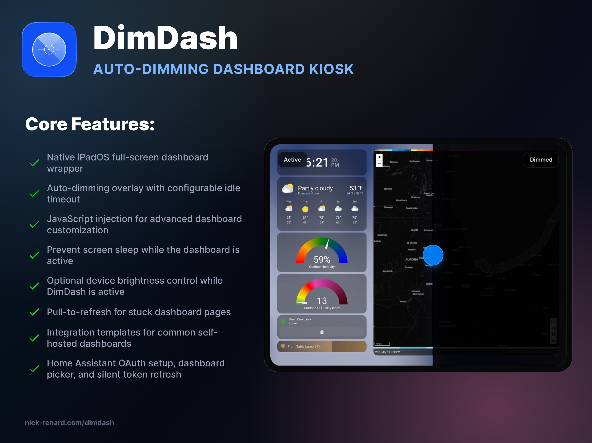
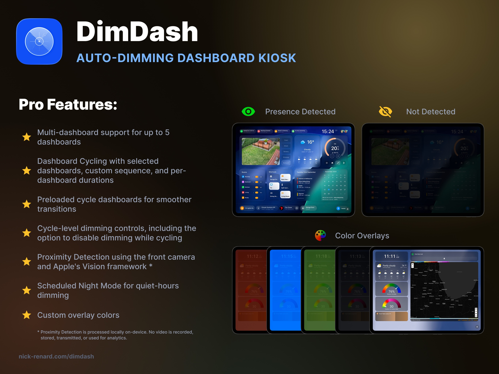

# DimDash Community

    
    

Welcome to the community hub for **DimDash**, the native iPadOS/iOS dashboard kiosk and auto-dimming app for wall-mounted smart home displays.

DimDash turns an iPhone or iPad into a full-screen dashboard for Home Assistant, Grafana, Dashy, Homarr, Glance, Node-RED Dashboard, Flame, or any custom web dashboard. It keeps your dashboard visible, dims intelligently when idle, and wakes instantly when you interact with it.

It also includes device display controls for wall panels, including keeping the screen awake while DimDash is open and optionally applying a DimDash-managed brightness level.

This repository is the public place for support, questions, bug reports, feature requests, setup notes, and community documentation.

## Useful Links

- Website: https://www.nick-renard.com/dimdash
- Privacy Policy: https://www.nick-renard.com/privacy
- Terms of Use: https://www.apple.com/legal/internet-services/itunes/dev/stdeula/
- App Store: https://apps.apple.com/us/app/dimdash/id6768683806

## What DimDash Does

DimDash is built for people who use an iPad as a smart home wall panel but want something more purpose-built than Safari, Guided Access alone, or browser workarounds.

Core features include:

- Native iPadOS/iOS full-screen dashboard wrapper
- Auto-dimming overlay with configurable idle timeout
- Adjustable overlay opacity and fade duration
- Prevent screen sleep while the dashboard is active
- Optional device brightness control while DimDash is active
- Pull-to-refresh for stuck dashboard pages
- Local HTTP/HTTPS dashboard support
- Integration templates for common self-hosted dashboards
- Home Assistant OAuth setup, dashboard picker, and silent token refresh
- JavaScript injection for advanced dashboard customization
- Privacy-first, on-device operation with no account and no analytics

## Supported Integrations

DimDash works with any web dashboard URL, and includes templates for:

- Home Assistant
- Grafana
- Homepage
- Dashy
- Homarr
- Glance
- Node-RED Dashboard
- Flame
- Custom URLs

## Home Assistant Support

DimDash includes a native Home Assistant setup flow:

- Local network discovery for Home Assistant instances
- OAuth sign-in
- Secure Keychain credential storage
- Dashboard picker using Home Assistant's WebSocket API
- Silent re-authentication through Home Assistant external auth
- Ability to add more dashboards from an existing Home Assistant connection
- Kiosk URL options for hiding Home Assistant chrome where supported

## DimDash Pro

DimDash Pro is an App Store subscription that unlocks the full kiosk experience.

Pro features include:

- Multi-dashboard support for up to 5 dashboards
- Dashboard Cycling with selected dashboards, custom sequence, and per-dashboard durations
- Preloaded cycle dashboards for smoother transitions
- Cycle-level dimming controls, including the option to disable dimming while cycling
- Proximity Detection using the front camera and Apple's Vision framework
- Scheduled Night Mode for quiet-hours dimming
- Custom overlay colors

Proximity Detection is processed locally on-device. No video is recorded, stored, transmitted, or used for analytics.

## Getting Help

Use **GitHub Discussions** for:

- Setup questions
- Home Assistant connection help
- Local network and certificate troubleshooting
- Camera permission questions
- Integration requests
- General feedback

Use **GitHub Issues** for:

- Reproducible bugs
- App crashes
- Incorrect behavior
- Broken setup flows
- UI issues with clear steps to reproduce

## Before Opening an Issue

Please include as much detail as possible:

- Device model, for example `iPad Pro 11-inch` or `iPad mini`
- iPadOS/iOS version
- DimDash app version and build number
- Dashboard type, for example Home Assistant, Grafana, Homepage, Dashy, or custom URL
- Whether the dashboard is local HTTP, local HTTPS, or public HTTPS
- Steps to reproduce the problem
- What you expected to happen
- What actually happened
- Screenshots or screen recordings, if helpful

For Home Assistant issues, also include:

- Home Assistant version
- URL format used, without passwords or tokens
- Whether OAuth setup completed successfully
- Whether the problem happens on first setup, app relaunch, or token refresh
- Whether local network permission has been granted

For Proximity Detection issues, include:

- Whether DimDash Pro is active
- Whether Proximity Detection is enabled
- Camera permission status in iOS Settings
- What the DimDash Proximity Detection status screen shows
- Whether camera frames are arriving
- Whether presence is detected at all

For Dashboard Cycling issues, include:

- Whether DimDash Pro is active
- How many dashboards are configured
- Which dashboards are included in the cycle
- The configured sequence and duration for each dashboard
- Whether Dim While Cycling is enabled
- Whether the issue happens at startup, after opening Settings, or only after several cycle rotations

## Privacy and Security

Please do not post secrets, tokens, passwords, private URLs, or screenshots containing sensitive dashboard data.

DimDash stores dashboard credentials in the iOS Keychain. Home Assistant OAuth credentials are used only to authenticate your own Home Assistant instance and refresh access silently inside the app.

## Feature Requests

Feature ideas are welcome. Good requests usually include:

- The problem you are trying to solve
- The dashboard/integration involved
- How often you would use it
- Whether it should be free or Pro
- Any screenshots, examples, or links to related projects

## Community Guidelines

Please keep discussions practical, kind, and focused on helping people build better smart home dashboard setups. DimDash is built for the self-hosted and Home Assistant communities, and the goal of this repo is to make support and feedback easy to follow.

## Project Status

DimDash is actively developed by Nicholas Renard. This repository is for community support and documentation, not the private app source code.

Thanks for helping make iPad wall dashboards less annoying and a lot more useful.
